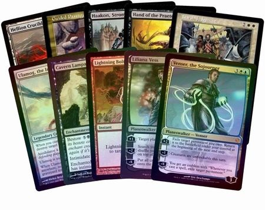

# Card Game Kernel

<!-- toc -->

- [Introduction](#introduction)
  * [The problem](#the-problem)
  * [The solution](#the-solution)
- [Proof of concept](#proof-of-concept)
  * [When card A is present, prevent the opponent from using cards of type B](#when-card-a-is-present-prevent-the-opponent-from-using-cards-of-type-b)
  * [Increment a card's counter every turn](#increment-a-cards-counter-every-turn)
  * [Attack the opponent's card](#attack-the-opponents-card)
  * [Pushing a state that makes the application change its course (must be handled by the application logic)](#pushing-a-state-that-makes-the-application-change-its-course-must-be-handled-by-the-application-logic)
- [API Example](#api-example)
  * [Global data store](#global-data-store)
  * [Containers](#containers)
  * [Cards](#cards)
  * [Hooks](#hooks)
  * [Triggering events](#triggering-events)
- [Install](#install)
- [Tests](#tests)

<!-- tocstop -->

## Introduction

A flexible engine for creating card games (Pokemon, Magic, etc) where the behavior of each card can be completely arbitrary.

<p align="center">
  
</p>


### The problem

Card games like Pokemon, Magic, Mitos y Leyendas, etc. are very difficult to code because every card can have any arbitrary behavior designed to be
understood verbally by a human being (and therefore difficult to understand for computers).

### The solution

This little software contains a framework where it's possible to design and code nearly any card game you can imagine. Some of the features:

* Cards have **events**, which are the main mechanism of communicating between cards, and achieving the desired behavior. Events can be triggered from many places, and a lot of customization is possible.
* Cards are divided into **containers**, which is a generic way of dividing a deck into your hand, the opponent's hand, disposed cards, etc. Each card of the entire set of cards present in the game fall in one container.
* Containers can be nested, and they can be found by their path, e.g. `[:player1, :hand]` or `[:player2, :cemetery]`
* It manages data and state globally using Redux (or a similar data store).
* Attributes can be added dynamically to cards.
* Events can have `pre` and `post` hooks so you can control the execution with detail.
* Generic, unopinionated solution.
* It can also be used for games that require a similar mechanism, like Final Fantasy or Pokemon battle systems, which require to implement many techniques and movements which behavior differs significantly from each other and there's no standard reusable model.

This is a very low level software, and therefore in order to work with it, further layers of abstraction must be written by the developer. This engine doesn't even force you to implement the concept of `turns` or `deck`. You simply have a few data structures that communicate with each other, and you must write the rest of the logic yourself.

Since this software is a low level framework, one class has to be created for each different card (usually by inheriting from the base `Card` class). In order to make it easier to work with, a wrapper can be written in a similar way ORMs like Hibernate or ActiveRecord help developers work easily with databases. However, this project won't include a wrapper, since the goal is to keep it low level.

## Proof of concept

In order to prove this software can achieve a flexible way of developing any card game, where cards can have any imaginable behavior, a few proof of concept test cases were developed. Some of these were coded as tests and can be found in the following link.

[Code of some of these examples](spec/proof_of_concept)

### When card A is present, prevent the opponent from using cards of type B

Each card has a `transfer` event that executes whenever a card is transferred from one card container to another. In this case, the first container, and the next container could for instance be the attacking line, where you place all the cards that are going to attack the opponent.

Once the card is transferred from the first container to the next, the `transfer` event is executed, and then optionally validate that the card is in the correct container, and then setup a `pre` hook for the `transfer` event where you only focus on the opponent's containers. In this case, this `pre` hook will return `false` in case the opponent is trying to transfer a card from one container to another (for example again, from his hand to his attacking line) and therefore achieving the objective.

Once the card that originated the `pre` hook is transferred away, the hook may be eliminated.

### Increment a card's counter every turn

First, no card has any default `counter` attribute, so it has to be added dynamically. Then create a `new_turn` event, which when triggered, a `pre` hook will increment the counter inside the card.

There are many ways to trigger the event only for the card you want. One way is to setup the hook globally, and then execute it for all cards inside a container, or also it's possible to setup a hook only for one card.

### Attack the opponent's card

Make a card respond to a `receive_attack` event. Since triggered events can also have arguments, a `damage` attribute can also be included.

This event can be triggered from many places, and it depends on how you want to establish your application's logic.

*Bonus:* If you include the attacking card reference as part of the event arguments, you'll have access to that card from the card that receives damage, so you could also create something along the lines of:
* If A receives damage by B, it will counterattack with 10% of the total damage.
* If A dies (HP=0) while being attacked by B, B also dies (by triggering one of B's events).
* More.

### Pushing a state that makes the application change its course (must be handled by the application logic)

Each turn has several stages, `stage1`, `stage2`, `stage3`, and so on. Suddenly, something happens and a card has an event triggered, and within the event handler, it pushes a new state onto the history stack. This state makes the game change its course, and one of the players is now forced to withdraw a card from his deck. The game will only continue once he's done with this.

There's a global data store (Redux is encouraged, although any can be used as long as it supplies the correct interface), and this can store any kind of data you want. In this case we need a state stack.

Since cards can communicate with the global data, a card can directly push a new state onto the stack. The next part consists of handling each state by applying user defined logic, and this can be done *from outside* this framework. In other words, the user must use this as a library and build on top of it by adding logic. If we change the state from `stage3` to `choosing_card`, it's the duty of the user to implement, let's say, a GUI menu that shows every possible card to pick, and when it's done, pop the state and go back to `stage3`.

If the card that triggered this state change wants to limit or filter out some cards (for example, choosing cards that are stronger than 120 is prohibited), we can also use the global data store and set a predicate (lambda function) there, so it can be accessed and used from outside. Just make sure the application logic knows about that predicate, so it can find and use it.

## API Example

### Global data store

Let's create a global data store using the Rydux gem. You can create your own data store as long as it implements the methods defined in the `DataStore` class.

```ruby
class PlayerReducer < Rydux::Reducer
  def self.map_state(action, state = { gold: 0, level: 1, bonus: 0 })
    case action[:type]
    when :increment_gold
      gold = state[:gold]
      state.merge(gold: gold + 1)
    when :decrement_gold
      gold = state[:gold]
      state.merge(gold: gold - 1)
    when :level_up
      level = state[:level]
      bonus = state[:bonus]
      bonus = bonus + 1 if level % 10 == 0 # Bonus +1 each time it goes 10 levels up
      state.merge(level: level + 1, bonus: bonus)
    else
      state
    end
  end
end

# And then

class MyDataStorage < DataStore

  def initialize
    @store = Rydux::Store.new(player1: PlayerReducer, player2: PlayerReducer)
  end

  def set_data(action:, arguments: {})
    @store.dispatch(type: action, payload: arguments)
    get_data_lambda = lambda { Store.state }
  end

  def get_data
    {
      player1: @store.player1,
      player2: @store.player2
    }    
  end
end
```

### Containers

Here we'll make some card containers. All the cards in the game are separated into containers, and these can be nested.

```ruby
kernel = CardKernel.new

kernel.create_container [:player1]
kernel.create_container [:player1, :hand]
kernel.create_container [:player1, :deck]

kernel.create_container [:player2]
kernel.create_container [:player2, :hand]
kernel.create_container [:player2, :deck]

kernel.create_container [:shared_cards]
```

Let's now add some cards to the containers.

```ruby

container = kernel.create_container [:player1, :hand]

# Use the data storage class we created before

my_data = MyDataStorage.new

container.add_card(Card.new(id: 1, data_store: my_data))
container.add_card(Card.new(id: 2, data_store: my_data))
container.add_card(Card.new(id: 3, data_store: my_data))
```

### Cards

The `Card` class can be overridden and you can define detailed behavior by registering events (and its handlers) to which this class of cards will react to.

Here we create a type of card that can receive damage.

```ruby
class AttackerCard < Card

  def initialize(id:)
    super(id: id)

    # This card has a custom attribute, health points (HP)
    set_attributes({ hp: 100 })

    # Event handler for when it receives an attack.
    # We register the event by its name, and then define an event handler for when it's triggered.
    on(:receive_attack, lambda { |args|

      # Decrement its health points (HP)
      current_hp = self.attributes[:hp]
      set_attributes({ hp: current_hp - args[:damage] })

      # Counter attack by triggering the same event on the card that attacked first
      if args.has_key?(:can_counterattack) && args[:can_counterattack] == true
        args[:attacker_card].trigger_event(event: :receive_attack,
          arguments: {
            damage: 3,
            can_counterattack: false # If this is true, it'd become an infinite loop
          })
      end

      return {
        current_hp: self.attributes[:hp]
      }
    })

  end
end
```

Of course instances of this newly created class can also be added to containers.

### Hooks

Hooks are functions that execute before and after the main event handler. This allows you to control more precisely what happens before and after an event. You can do things like blocking an event from happening, or doing some pre-processing logic that will change the way the main event handler behaves.

Hooks can be configured at a global scope, and a per card scope. Once an event is triggered, the order in which these execute is as follows.

```
global pre hook → card pre hook → main event handler → global post hook → card post hook
```

Creating a global hook. This hook will be executed for each card that has the `transfer` event triggered. Since it was
registered using the `pre` symbol, it will execute before the main event handler for `transfer`. Also note that `transfer` is
a special event that executes automatically (no need to execute `card.trigger_event(...)`) when a card is moved from one container
to another.

```ruby
global_hooks = GlobalHooks.new
card = Card.new(id: 1, global_hooks: global_hooks)

lambda_hook = lambda { |args|

  # The transfer event will contain the "prev_container" and the "next_container" attributes in its argument object.
  # "prev_container" won't be included if it's the first time the card is put into a container.
  # The "card" attribute will be the card where the hooks are executing.
  if (!args[:prev_container].nil? && args[:prev_container].id == [:b]) && args[:next_container].id == [:b, :c] && args[:card].type == :my_type
    return false
  end

  return true
}

# "card_owner_id" is optional, as some global hooks don't need to be associated with any card in particular.
global_hooks.append_hook(:pre, event_name: :transfer, fn: lambda_hook, card_owner_id: 1)
```

Creating a card scoped hook. Similarly, you can register a lambda function as a `pre` hook inside a card.
It will execute only for instances of this card class.

```ruby
class PreHookCard < Card
  def initialize(id:)
    super(id: id)
    @pre[:transfer] = lambda { |args_|
      # ...
    }
  end
end
```


### Triggering events

Trigger an event for one card.

```ruby
card_instance.trigger_event(event: :event_name_goes_here, arguments: { arg1: 0, arg2: "hoge", arg3: "piyo" })
```

Trigger an event for all cards in a container.

```ruby
container_instance.trigger_event(event: :event_name_goes_here, arguments: { arg1: 0, arg2: "hoge", arg3: "piyo" }, recursive: false)
```

Note the `recursive` argument when triggering an event in a container. If it's `false`, it will only trigger the event for all cards inside that container, but will not trigger it for the cards inside the nested containers. If it's `true`, the event will be triggered for every card in the container and all cards in every container nested to it.

## Install

Install gems using the following command.

```bash
bundle
```

## Tests

Tests can be found at the `spec` folder, and can be run all at once by executing the following command (it needs to `gem install rspec` first).

```bash
rspec spec/
```
